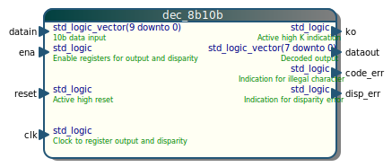

# VHDL 8b10b encoder and decoder
## Overview

This is an implementation of the 8b10b decoder and encoder as described by  Widmer and Franaszek.
The original source (Verilog) was obtained from Chuck Benz http://asics.chuckbenz.com/#My_open_source_8b10b_encoderdecoder

The code was translated into VHDL by Frans Schreuder in 2020. Some changes were also made to the behaviour:
 * Disparity is registered internally in the entities
 * The output is registered 
 * clock and reset pins were added
 * ena inputs added, in case the data is not valid every clockcycle, for instance when used in combination with a gearbox. 
 * **The 10 bit value (output of the encoder, input to the decoder) have a reverse bit-order compared to the original verilog source**
 * The part in dec_8b10b.vhd that calculates code_err was rewritten following the paper of Widmer and Franaszek "A DC-balanced, partitioned-block, 8B/10B transmission code"
   * The original code_err calculation by Chuck Benz was causing a few false errors in a project, which made me rewrite the error detection according to Widmer and Franaszek
   * The current code_err detection does not detect 122 "not in table" codes resulting in 122 warnings in the simulation. It has to be investigated whether these codes are really illegal.




## License
The original license statement in Chuck Benz' Verilog code was the following:
```
The information and description contained herein is the
property of Chuck Benz.

Permission is granted for any reuse of this information
and description as long as this copyright notice is
preserved.  Modifications may be made as long as this
notice is preserved.
```
With Chuck Benz permission, the following license was added:

Apache 2.0, see [LICENSE.md](./LICENSE.md)

## Simulating the testbench (using UVVM)
The simulation testbench depends on the UVVM library, which has been added 
as a submodule of this repository. Before using UVVM, you must initialize 
the submodule and compile UVVM. 
### Modelsim / Questasim
In this example Modelsim 2019.1 was used.
```
git submodule update --init
cd UVVM/script
vsim -do ./compile_all.do -c
cd ../..
```
To launch the actual simulation of the 8b10b encoder / decoder there is a script:
```
cd scripts
vsim -do simulate-modelsim.tcl
```
### GHDL
#### Installing GHDL
If you already have GHDL installed on your system, you can skip to the next step.
```
git clone https://github.com/ghdl/ghdl.git
cd ghdl
./configure --prefix=/usr/local
make -j 4
sudo make install
```
#### Compiling UVVM
* Edit /usr/local/lib/ghdl/vendors/config.sh and change line 48 to 
```
InstallationDirectories[UVVM]="."
```
* Run the following command:
```
cd ~/8b10b_VHDL/UVVM
/usr/local/lib/ghdl/vendors/compile-uvvm.sh -a
```
#### Run the simulation
Now that you have installed GHDL and compiled UVVM, the following script will run the simulation:
```
cd ~/8b10b_VHDL/scripts/
./simulate-ghdl.sh
```
## FPGA resources
The modules were synthesized for Xilinx Virtex7 using Vivado 2020.1. For this architecture the following resources should be accounted for.
|**Entity**| **LUTS** | **FF** |
|----|----|----|
|dec_8b10b.vhd | 30 | 12 |
|enc_8b10b.vhd | 15 | 11 |
